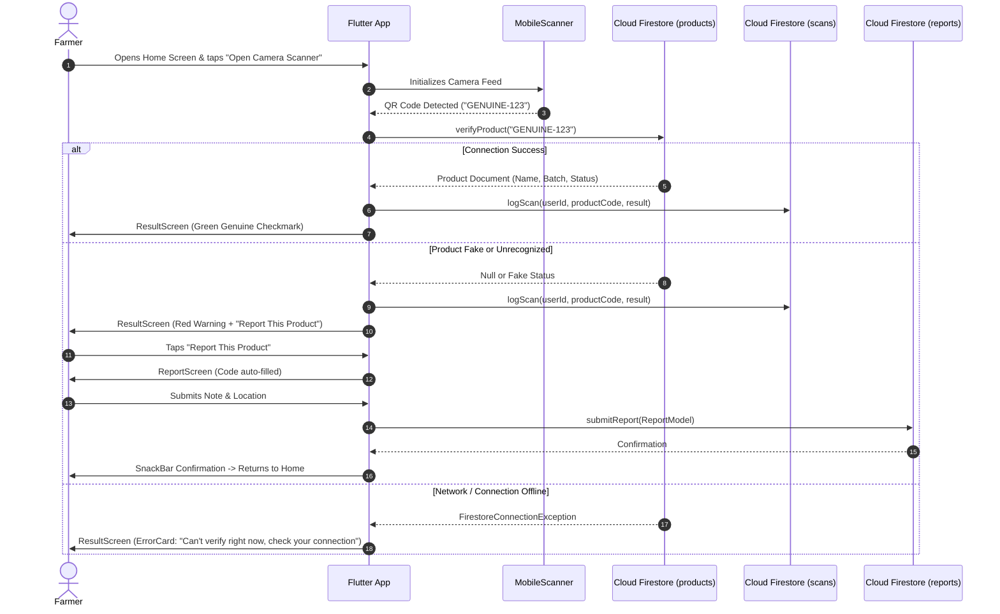
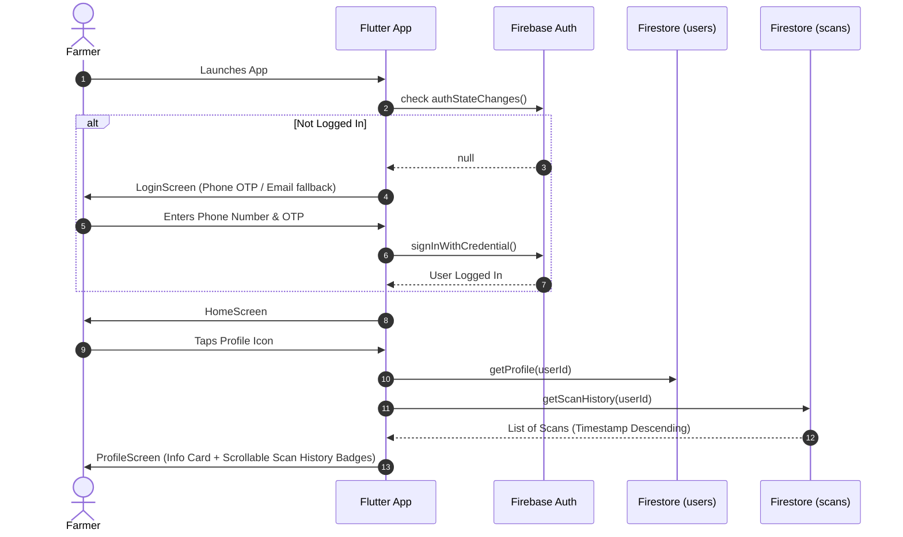

# Day 6 — User Flows & System Sequence Diagrams

## Flow 1 — Scan, Verify, Report

---

## Flow 2 — Auth & Farmer Profile

---

## Flutter Screen & Route Mapping Table

| Screen Name | File Path | Trigger / Action | Target Screen |
|---|---|---|---|
| `SplashScreen` | `lib/screens/splash_screen.dart` | Auth Check complete | `HomeScreen` or `LoginScreen` |
| `LoginScreen` | `lib/screens/login_screen.dart` | Auth Success / Guest | `HomeScreen` |
| `HomeScreen` | `lib/screens/home_screen.dart` | Tap "Scan Camera" | `ScanScreen` |
| `HomeScreen` | `lib/screens/home_screen.dart` | Tap "Profile" | `ProfileScreen` |
| `ScanScreen` | `lib/screens/scan_screen.dart` | QR Code Detected | `ResultScreen` |
| `ResultScreen` | `lib/screens/result_screen.dart` | Tap "Report Product" | `ReportScreen` |
| `ReportScreen` | `lib/screens/report_screen.dart` | Tap "Submit Report" | `HomeScreen` |
| `ProfileScreen` | `lib/screens/profile_screen.dart` | Tap Back | `HomeScreen` |
